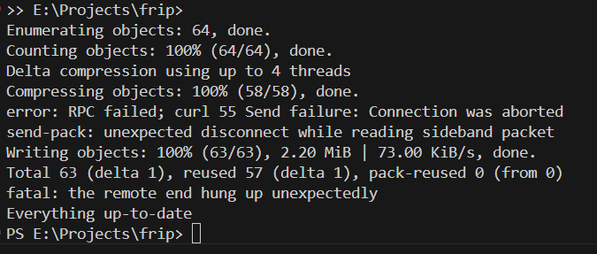

# 🛡️ FRIP – Financial Risk Intelligence Platform

<p align="center">
  <strong>An AI-powered platform for real-time Fraud Detection & Tax Risk Intelligence</strong>
</p>

<p align="center">
  <a href="https://syedtwasti.github.io/FRIP-Financial-Risk-Intelligence-Program-/">
    
  </a>
  
  
  
  
</p>

---

## 🌐 Live Demo

🔗 **https://syedtwasti.github.io/FRIP-Financial-Risk-Intelligence-Program-/**

---

## 📸 Dashboard Preview

<p align="center">
  
</p>

---

# 📖 Overview

**FRIP (Financial Risk Intelligence Platform)** is an AI-powered financial analytics platform designed to identify fraudulent transactions and detect potential tax evasion through machine learning.

The platform combines modern web technologies, explainable AI, and geospatial visualization into a single interactive dashboard, enabling analysts to monitor financial risk in real time.

---

# ✨ Key Features

### 💳 Real-Time Fraud Detection
- Predicts fraudulent transactions instantly.
- Assigns Fraud Probability Scores.
- Categorizes transactions into:
  - 🟢 Low Risk
  - 🟡 Medium Risk
  - 🔴 High Risk

---

### 🧾 Tax Risk Intelligence

Builds comprehensive taxpayer profiles by analysing:

- Income
- Spending behaviour
- Vehicle ownership
- Real estate assets
- Lifestyle indicators

Generates an overall **Tax Risk Score** to identify possible tax evasion.

---

### 🌍 Geospatial Intelligence

- Interactive Leaflet maps
- High-risk transaction visualization
- Fraud hotspot identification
- Regional financial activity analysis

---

### 📊 Interactive Analytics

Visualize financial intelligence using:

- Risk distributions
- Transaction trends
- Fraud frequency
- Geographic clusters
- Historical analytics

---

### 🤖 Explainable Artificial Intelligence

Unlike traditional black-box models, FRIP explains *why* a prediction was made using **SHAP (SHapley Additive Explanations)**, allowing analysts to understand the factors contributing to each risk score.

---

# ⚙️ System Architecture

```
             User Input
                  │
                  ▼
          React Dashboard
                  │
            Axios Requests
                  │
                  ▼
           FastAPI Backend
                  │
      ┌───────────┴───────────┐
      ▼                       ▼
 Fraud Detection ML      Tax Risk ML
      │                       │
      └───────────┬───────────┘
                  ▼
             SHAP Explainability
                  │
                  ▼
             SQL Database
                  │
                  ▼
         Interactive Dashboard
```

---

# 🔍 How FRIP Works

## 1. Data Collection

Financial transaction and taxpayer information is submitted through the dashboard.

---

## 2. Data Processing

The FastAPI backend:

- validates inputs
- preprocesses features
- normalizes values
- prepares model-ready datasets

using:

- Pandas
- NumPy

---

## 3. Machine Learning Prediction

The processed data is evaluated using trained models built with:

- Scikit-Learn
- XGBoost

The models generate:

- Fraud Score
- Tax Risk Score
- Risk Classification

---

## 4. Explainability

SHAP determines which features contributed most to each prediction, improving transparency and analyst confidence.

---

## 5. Data Storage

Predictions and transaction history are stored using SQLAlchemy for future analysis and auditing.

---

## 6. Visualization

The React dashboard displays:

- Live metrics
- Interactive charts
- Risk distributions
- Heatmaps
- Geographic markers

---

# 🛠 Technology Stack

| Category | Technologies |
|-----------|--------------|
| Frontend | React 19, Vite |
| Backend | FastAPI |
| Machine Learning | Scikit-Learn, XGBoost |
| Explainable AI | SHAP |
| Data Processing | Pandas, NumPy |
| Database | SQLAlchemy (SQLite / PostgreSQL) |
| Mapping | Leaflet, React Leaflet |
| Charts | Recharts |
| API Communication | Axios |
| Server | Uvicorn |

---

# 🚀 Getting Started

## Prerequisites

- Python 3.8+
- Node.js 18+
- npm

---

## Quick Start

Simply run

```bash
start.bat
```

This launches both the backend and frontend automatically.

---

# Manual Installation

## Backend

```bash
git clone https://github.com/SyedTWasti/FRIP-Financial-Risk-Intelligence-Program-.git

cd FRIP-Financial-Risk-Intelligence-Program-

python -m venv venv

venv\Scripts\activate

pip install -r requirements.txt

uvicorn src.api.main:app --reload --port 8000
```

Backend API

```
http://localhost:8000
```

Swagger Documentation

```
http://localhost:8000/docs
```

---

## Frontend

```bash
cd frontend

npm install

npm run dev
```

Dashboard

```
http://localhost:5173
```

---

# 📁 Project Structure

```text
FRIP
│
├── frontend/
│   ├── src/
│   ├── public/
│   └── package.json
│
├── src/
│   ├── api/
│   ├── models/
│   ├── database/
│   └── utils/
│
├── data/
│
├── requirements.txt
├── start.bat
├── frip.db
└── README.md
```

---

# 🎯 Future Improvements

- User Authentication
- Role-Based Access Control
- Live Streaming Transactions
- Kafka Integration
- Docker Deployment
- Cloud Deployment (AWS / Azure)
- Graph Neural Networks for Fraud Detection
- Advanced Financial Network Analysis

---

# 👨‍💻 Author

**Syed Tuaha Wasti**

GIS Engineer • AI Developer • Full Stack Developer

---

# 📄 License

This project is proprietary and confidential.

All rights reserved © 2026.
